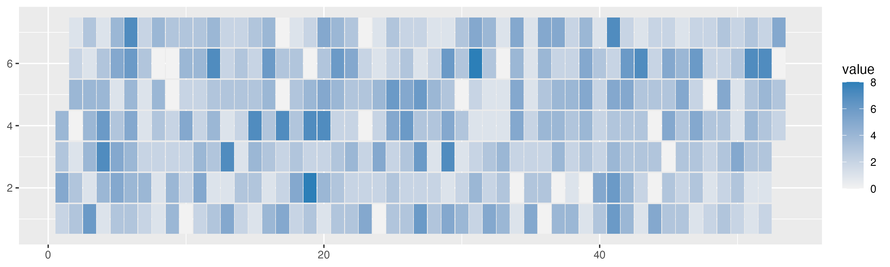
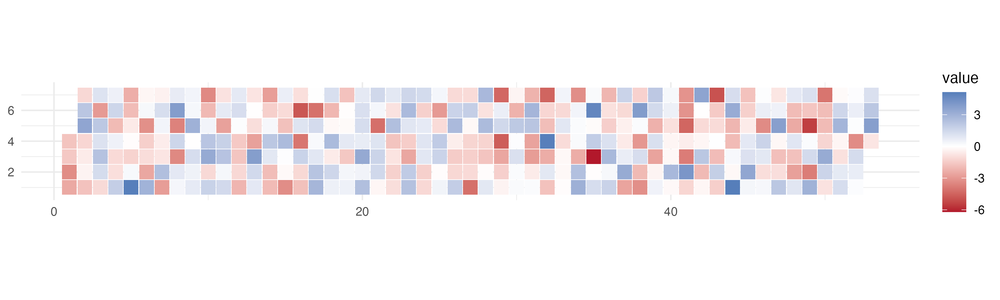
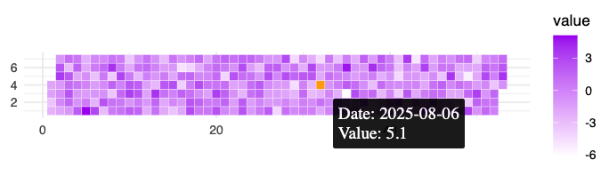

# ggcalheat

`ggcalheat` provides calendar heatmaps for `ggplot2` with a simple API: map `date` and `value`, then call `geom_calendar()`.

<br>

## Installation

```r
remotes::install_github("y-sunflower/ggcalheat")
```

<br>

## Quick start

```R
library(ggplot2)
library(ggcalheat)

df <- data.frame(
  date = seq.Date(as.Date("2025-01-01"), as.Date("2025-12-31"), by = "day"),
  value = rpois(365, lambda = 3)
)

ggplot(df, aes(date = date, value = value)) +
  geom_calendar() +
  scale_fill_gradient(low = "grey95", high = "#2C7FB8") +
  theme_minimal()
```



<br>

- Signed values are supported directly with standard continuous scales:

```r
df <- data.frame(
  date = seq.Date(as.Date("2025-01-01"), as.Date("2025-12-31"), by = "day"),
  value = rnorm(365, mean = 0, sd = 2)
)

ggplot(df, aes(date = date, value = value)) +
  geom_calendar() +
  scale_fill_gradient2(
    low = "#B2182B",
    mid = "white",
    high = "#2166AC",
    midpoint = 0
  ) +
  theme_minimal()
```



<br>

- Interactive with ggiraph

```r
library(ggplot2)
library(ggcalheat)
library(ggiraph)

gg <- ggplot(df, aes(date = date, value = value)) +
  geom_calendar_interactive(aes(
    tooltip = paste("Date:", date, "\nValue:", round(value, 1)),
    data_id = as.character(date)
  )) +
  scale_fill_gradient(low = "white", high = "purple") +
  theme_minimal()

girafe(ggobj = gg)
```



[See more examples](https://y-sunflower.github.io/ggcalheat/)
